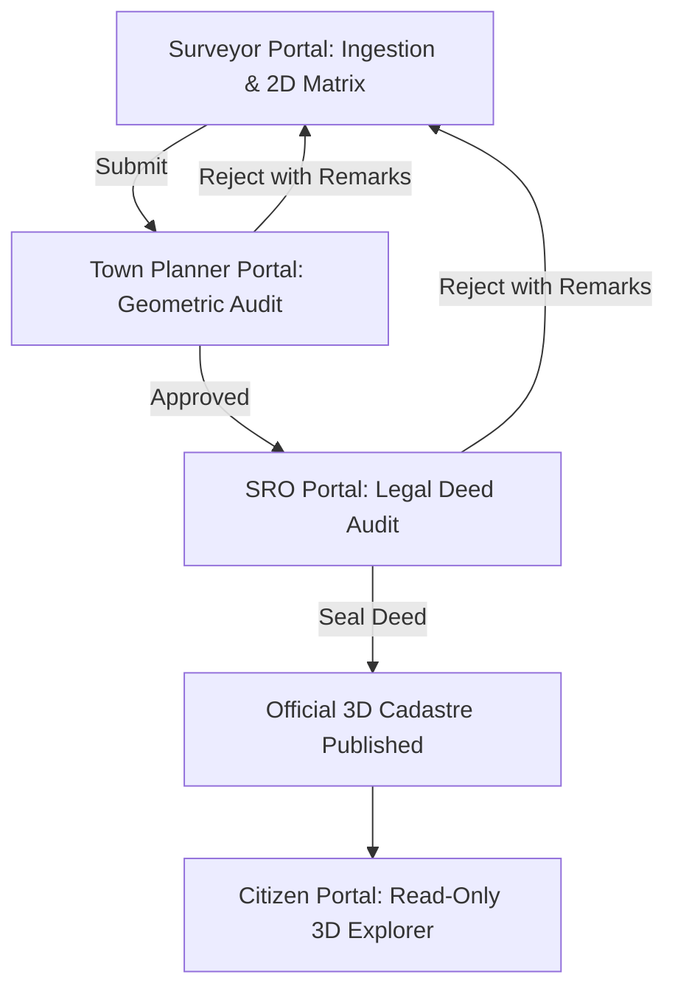

# National 3D ULPIN & Vertical Cadastre Web Framework
### Digital India Land Records Modernization Programme (DILRMP) | Ministry of Land Resources

A production-ready, multi-role 3D Cadastral Web Framework and ISO 19152 LADM-compliant Vertical Strata Registry System with strict role-based separation, real-time Three.js 3D WebGL volumetric rendering, interactive geocoding/pin correction, automated geometric compliance audit, statutory deed sealing, and state rollbacks.

---

## 🏛️ System Roles & Workflow Lifecycle



### 1. Surveyor Portal (Data Intake & Revision)
- **Interactive Location Intake**: Lookup via address, exact Lat/Long coordinates, or Google Maps URL (`https://maps.google.com/?q=...`), with a draggable pin map component.
- **Flexible Component Intake (Graceful Degradation)**: Upload LiDAR point clouds (`.las`/`.laz`), Drone orthophotos (`.tif`), GIS vectors (`.geojson`), or CAD drawings (`.dxf`). Removable file chips (Gemini style) with `×` remove buttons.
- **Parametric Fallback & Bulk Flat Configuration**: Declares identical floor/flat configurations with custom overrides for unique units.
- **2D Vertical Plan Matrix**:
  - `Select All Flats` checkbox.
  - Floor-by-floor rows from Floor N down to Ground Floor.
  - Selected flats retain vivid assigned colors, while unselected flats turn translucent grey in both 2D and 3D!
- **Real-Time Three.js 3D WebGL Canvas**:
  - Volumetric extrusion with color-coded strata units.
  - **Explode Floor Feature**: Slider (0% to 100%) and interactive animation.
  - Raycaster hover tooltip and click inspection.
  - **3D ULPIN Generator**: Formula `= 2D ULPIN + B{bldg:02d} + F{floor:03d} + U{flat:03d}` (e.g. `72541DC5174453-B01-F002-U202`).
- **Revision Handling**: Displays remarks from Town Planner or SRO rejections with 1-click recalculation and resubmission.

### 2. Town Planner Portal (Geometric Compliance & Review)
- Automatically checks building geometry against local municipal zoning bye-laws (FAR/FSI $\le 2.50$, Max Height $\le 18.0m$, Ground Coverage $\le 65\%$, Fire Access $\ge 1.5m$).
- Displays itemized **Auto-Accepted** vs **Auto-Rejected** items.
- Side-by-side 3D WebGL model with floor explosion.
- Actions: **Approve Geometry & Forward to SRO** or **Reject & Rollback to Surveyor** with mandatory text remarks.

### 3. Sub-Registrar Office (SRO) Portal (Legal & Ownership Audit)
- SRO Action Queue: `Deed Sealed`, `Awaiting SRO Deed`, `In Municipal Audit`, `Revision Required`.
- **Itemized Floor & Flat Audit Filtering**: Filter by floor (e.g. `Floor 2`) or floor + flat (e.g. `Floor 2, Flat 202`).
- Unit-level audit checklist (Title deed reference, owner share, tax clearance, encumbrance status) with `Accept / Not Accept` toggles.
- Actions: **Lock 3D Cadastre & Issue Official 3D ULPIN** or **Reject Deed & Rollback to Surveyor** with mandatory remarks.

### 4. Citizen Portal (Read-Only 3D Explorer)
- Public search by 2D ULPIN, 3D ULPIN, or Registered Deed Reference.
- Strictly read-only interactive 3D building viewer with floor explode slider and flat highlight.
- Downloadable certified 3D Cadastral Property Card.

---

## 🛠️ Technical Stack

- **Backend**: Python 3.10+, FastAPI, Pydantic v2, Uvicorn, GeoPandas, Shapely, PyProj.
- **Database**: Supabase / PostgreSQL with PostGIS extension (`POLYGON Z` & `POLYHEDRALSURFACE Z` 3D spatial storage).
- **Frontend**: Vanilla JS (ES6+), Modern Responsive CSS3, Three.js (WebGL 3D Rendering & OrbitControls), Leaflet Map API.
- **ML / Training**: PyTorch, TorchScript, ONNX, OpenCV, Rasterio.

---

## 🚀 Quickstart & Running Locally

### 1. Install Dependencies
```bash
pip install fastapi uvicorn pydantic pytest
```

### 2. Run Backend API Server
```bash
python -m uvicorn backend.main:app --host 0.0.0.0 --port 8000 --reload
```
Open your browser at: **`http://localhost:8000`**

### 3. Run Automated Backend Test Suite
```bash
python -m pytest backend/test_api.py -v
```

---

## 🧠 Machine Learning Training Pipeline (`/training`)

The system includes trained geospatial ML models for multi-source cadastral ingestion:

1. **Drone Footprint Segmentation** (`training/models/drone_segmentation.py`):
   - Architecture: Residual Convolutional U-Net.
   - Benchmark: SpaceNet 2 / Inria Aerial Image Labeling.
2. **LiDAR Point Cloud Semantic Segmentation** (`training/models/lidar_classification.py`):
   - Architecture: PointNet / PointNet++ 3D classification.
   - Benchmark: ISPRS 3D Semantic Labeling Contest (Vaihingen / Toronto).
3. **Architectural Floorplan Parser** (`training/models/floorplan_parser.py`):
   - Architecture: Multi-Scale CNN with OpenCV vector polygon boundary extractor.
   - Benchmark: CVC-FP / CubiCasa5k.

### Run ML Evaluation & Model Export
```bash
# Evaluate model benchmarks (mIoU, Precision, Recall, F1-score)
python -m training.evaluate

# Export trained weights to ONNX / TorchScript for production inference
python -m training.export_weights
```

---

## 📂 Project Directory Structure

```
├── backend/
│   ├── main.py                 # FastAPI Application & REST Endpoints
│   ├── cadastre_engine.py      # Location parser, 3D ULPIN, compliance rules
│   ├── models.py               # Pydantic data schemas & enums
│   ├── database.py             # Transactional state & audit trail repo
│   ├── schema.sql              # Supabase PostGIS 3D database schema
│   └── test_api.py             # Comprehensive test suite (6 tests)
├── static/
│   ├── css/styles.css          # Government portal stylesheet
│   └── js/app.js               # Three.js 3D viewer & state machine
├── training/
│   ├── configs/                # YAML configs for drone, lidar, floorplan
│   ├── datasets/               # Data loaders for SpaceNet, ISPRS, CVC-FP
│   ├── models/                 # PyTorch models (U-Net, PointNet, FloorplanNet)
│   ├── evaluate.py             # Benchmark metric evaluator (mIoU, F1)
│   ├── export_weights.py       # ONNX / TorchScript exporter
│   └── README.md               # Training documentation
├── index.html                  # Multi-role cadastral web application
└── README.md                   # Project overview & deployment guide
```
